<h1 align="center">Lumma Agendamentos</h1>

<p align="center">
  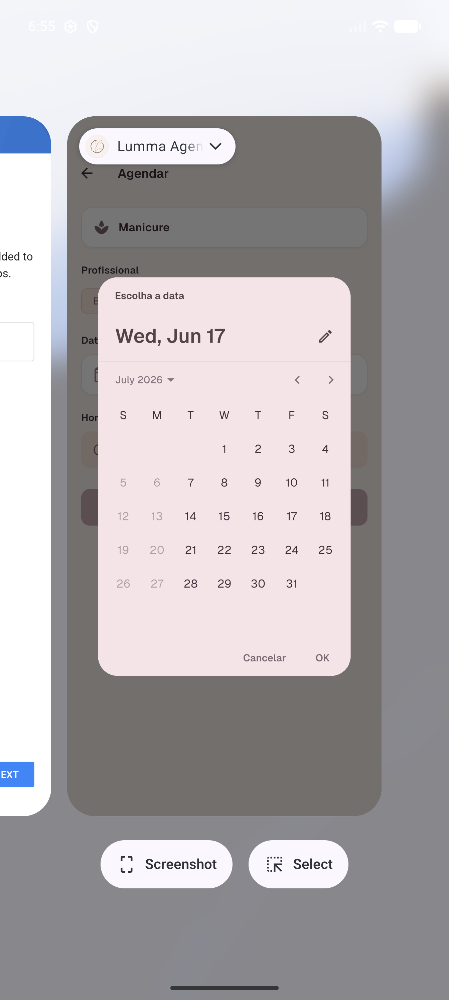<br>
  <em>O app instalado, com identidade visual própria do Espaço Lumma, e não o ícone padrão do Flutter.</em>
</p>

<p align="center">
  App mobile nativo em <strong>Flutter</strong> para o cliente de um salão de beleza marcar, acompanhar e cancelar
  o próprio horário, conversando com um <strong>backend próprio</strong> em Next.js sobre Supabase/Postgres.
</p>

---

Este é o meu projeto da ponderada. Eu (Gabriel) construí um app de agendamentos de ponta a ponta:
a interface mobile, o backend que serve a API, o banco de dados e as integrações com hardware e serviços
externos. A documentação abaixo conta como eu pensei o problema, como montei a arquitetura, como atendi
cada requisito da atividade e, principalmente, quais foram as partes difíceis e como eu as resolvi.

## Índice

- [O problema e o público-alvo](#o-problema-e-o-público-alvo)
- [A solução, em uma olhada](#a-solução-em-uma-olhada)
- [Demonstração em telas](#demonstração-em-telas)
  - [Abertura, login e cadastro](#abertura-login-e-cadastro)
  - [Home com GPS ativo](#home-com-gps-ativo)
  - [Catálogo, calendário e horários](#catálogo-calendário-e-horários)
  - [Criar, confirmar e notificar](#criar-confirmar-e-notificar)
  - [Anti-overbooking: o 409](#anti-overbooking-o-409)
  - [Detalhe: compartilhar, salvar na agenda e cancelar](#detalhe-compartilhar-salvar-na-agenda-e-cancelar)
- [Agendamento por linguagem natural (IA)](#agendamento-por-linguagem-natural-ia)
- [Arquitetura](#arquitetura)
- [Como cada requisito da atividade foi atendido](#como-cada-requisito-da-atividade-foi-atendido)
- [Stack e bibliotecas, com justificativa](#stack-e-bibliotecas-com-justificativa)
- [Como rodar o projeto](#como-rodar-o-projeto)
- [Problemas que enfrentei e como resolvi](#problemas-que-enfrentei-e-como-resolvi)
- [Limitações conhecidas e próximos passos](#limitações-conhecidas-e-próximos-passos)
- [Checklist de entrega](#checklist-de-entrega)
- [Vídeo de demonstração](#vídeo-de-demonstração)
- [Estrutura do repositório](#estrutura-do-repositório)

---

## O problema e o público-alvo

O Espaço Lumma é um salão de beleza real, com duas unidades na região de São Paulo (Granja Viana, em Cotia,
e Alphaville, em Barueri). Hoje os horários são gerenciados na mão, em agenda de papel, conversa por WhatsApp
e anotações da recepção. Isso gera dois problemas concretos:

1. **O cliente não tem autonomia.** Para marcar, remarcar ou só conferir o horário, ele depende de alguém do
   salão responder. Fora do horário comercial, ninguém marca nada.
2. **Acontece overbooking.** Quando duas pessoas pedem o mesmo horário com a mesma profissional quase ao mesmo
   tempo, é fácil a recepção marcar as duas sem perceber, e aí alguém chega e não tem vaga.

O **público-alvo** é a cliente do salão: alguém que quer marcar um serviço (manicure, design de sobrancelha,
extensão de cílios, massagem etc.) com uma profissional específica, numa das duas unidades, sem precisar falar
com ninguém. A minha proposta é um app no celular dela que resolve as duas dores: dá **autonomia** para marcar,
ver e cancelar sozinha, e **garante que dois clientes nunca fiquem com o mesmo horário** com a mesma profissional.

## A solução, em uma olhada

Eu construí um app Flutter nativo que fala com um backend próprio. O cliente faz login, vê as unidades ordenadas
pela distância até ele (usando o GPS do aparelho), escolhe um serviço do catálogo, uma profissional, uma data
num calendário que já bloqueia feriados e dias fechados, e um horário livre calculado no servidor. Ao confirmar,
o agendamento é criado no banco, ele recebe uma notificação local de confirmação e um lembrete antes do horário.
No detalhe do agendamento ele pode compartilhar um comprovante, salvar o evento na agenda do celular (arquivo
`.ics`) e cancelar, e o cancelamento desfaz o lembrete.

Quem prefere ir direto também pode **descrever o agendamento em uma frase** ("manicure sexta de manhã com a
Aline na Alphaville"). O backend interpreta o texto com um modelo de linguagem, valida cada campo contra o
catálogo real e devolve a intenção mais horários livres; o app pré-preenche o fluxo e a pessoa confirma. O
modelo nunca agenda sozinho nem decide preço ou disponibilidade, e se o texto não der para entender o app cai,
sem ruído, no passo a passo manual.

<table>
<tr>
<td align="center" width="50%">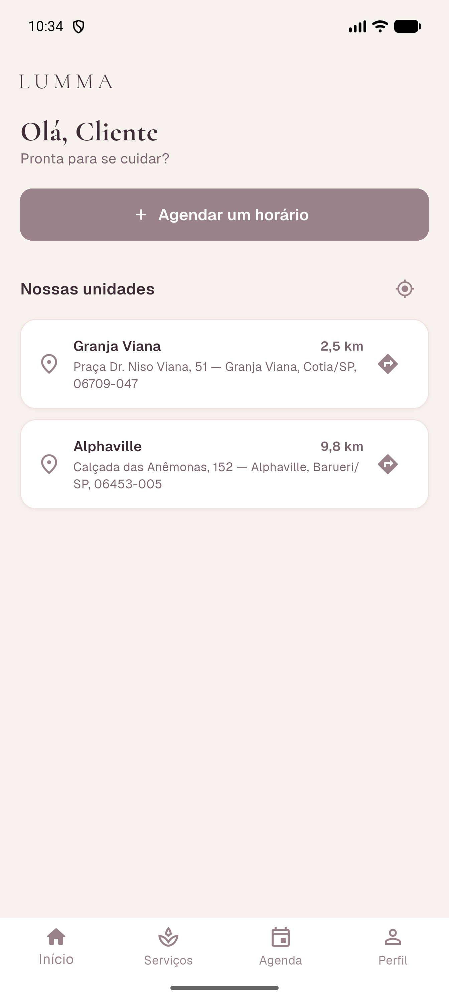<br><em>Home: saudação, próximo agendamento e as duas unidades ordenadas pela distância real (GPS).</em></td>
<td align="center" width="50%">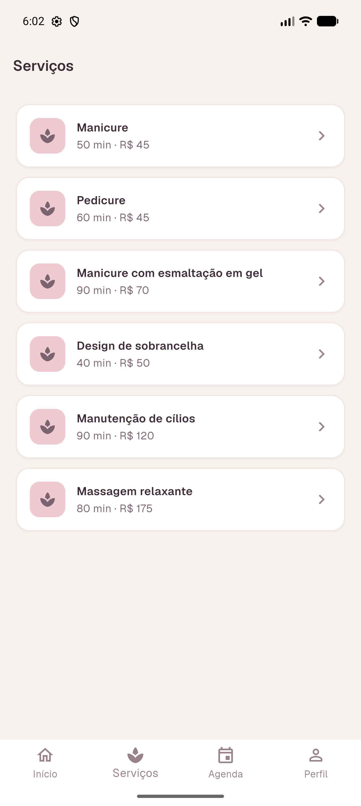<br><em>Catálogo de serviços carregado do backend, com duração e valor de cada um.</em></td>
</tr>
</table>

O ponto técnico de que mais me orgulho é o **anti-overbooking**: a criação do agendamento passa por uma função
no Postgres que serializa, com um *advisory lock*, apenas as tentativas para o mesmo profissional/dia/unidade, e
faz uma re-checagem de sobreposição de horários dentro da mesma transação. Se o horário foi tomado, o app mostra
uma mensagem amigável e recarrega os horários, sem erro técnico na cara do usuário.

## Demonstração em telas

Esta seção segue o caminho do usuário. As capturas são de execuções reais no emulador, ao longo do
desenvolvimento.

### Abertura, login e cadastro

Ao abrir, o app mostra a marca numa splash enquanto verifica se já existe uma sessão salva. O login é **real**:
chama o endpoint de autenticação do backend, recebe um token de acesso e guarda em armazenamento seguro do
aparelho (`flutter_secure_storage`). A navegação reage ao estado real do token: sem token, o app me leva para
o login; com token válido, vai direto para a Home.

<table>
<tr>
<td align="center" width="50%"><br><em>Tela de login com a identidade da marca.</em></td>
<td align="center" width="50%"><br><em>Cadastro real: cria o usuário no backend (nome, e-mail, telefone, senha).</em></td>
</tr>
</table>

### Home com GPS ativo

A Home usa o **GPS do aparelho** (sensor de hardware). Eu pego a posição atual do cliente e calculo a distância
geográfica até cada unidade com `Geolocator.distanceBetween`, ordenando da mais perto para a mais longe. As duas
unidades aparecem com a distância ("Granja Viana · 2,5 km") e um botão "Como chegar".

<table>
<tr>
<td align="center" width="50%"><br><em>Com a localização perto da Granja Viana: 2,5 km / 9,8 km, ordenadas.</em></td>
<td align="center" width="50%"><br><em>Mudei a posição simulada para outro ponto da cidade: as distâncias recalculam (13,8 km / 17,1 km).</em></td>
</tr>
</table>

Se a permissão de localização for negada, a tela **degrada com elegância**: continua listando as unidades, sem
distância, com um aviso e um botão para ativar, e nada quebra. E o "Como chegar" abre o app de mapas na rota até
as coordenadas reais da unidade (deep link `geo:`/Google Maps).

<table>
<tr>
<td align="center" width="50%">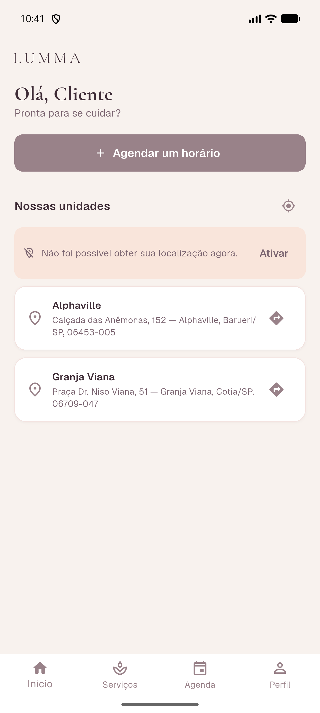<br><em>Sem localização: as unidades continuam visíveis, com aviso e CTA, sem crash.</em></td>
<td align="center" width="50%">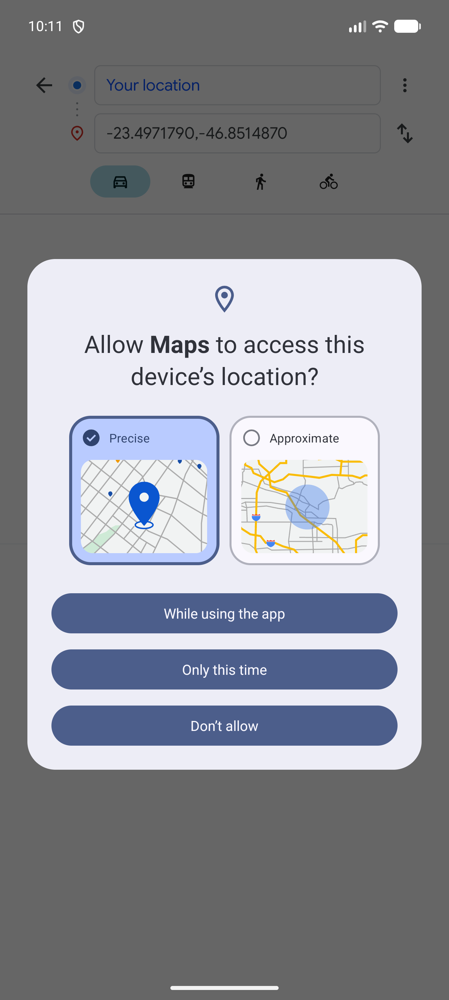<br><em>"Como chegar" abre a rota no Google Maps para as coordenadas da unidade (Alphaville).</em></td>
</tr>
</table>

### Catálogo, calendário e horários

O catálogo de serviços e de profissionais vem todo do backend. No calendário, além de bloquear domingo e segunda
(o salão abre de terça a sábado), eu bloqueio **feriados nacionais** consumidos de uma API externa. Os horários
livres são calculados no servidor, considerando a duração de cada serviço.

<table>
<tr>
<td align="center" width="50%">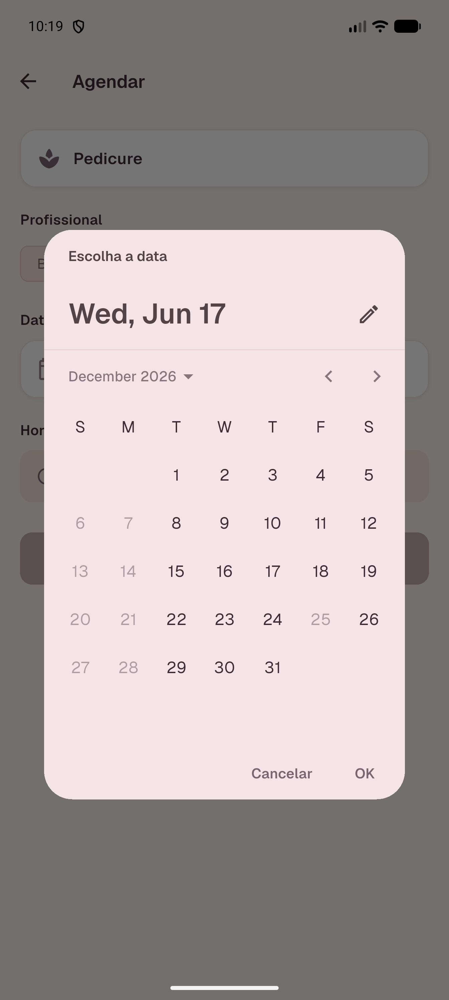<br><em>Dezembro/2026: o dia 25 (Natal, uma sexta) está desabilitado, enquanto as outras sextas continuam clicáveis, o que prova a regra de feriado, e não apenas a de dia fechado.</em></td>
<td align="center" width="50%">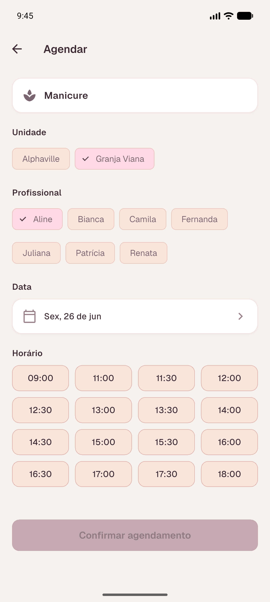<br><em>Grade de horários livres, em células de tamanho fixo, vinda do cálculo de disponibilidade do servidor.</em></td>
</tr>
</table>

### Criar, confirmar e notificar

Ao confirmar, o app cria o agendamento no banco, dispara uma **notificação local de confirmação** com os dados do
horário e me leva para uma tela de sucesso. O agendamento aparece na hora em "Meus Agendamentos", lista filtrada
pelo e-mail do usuário logado.

<table>
<tr>
<td align="center">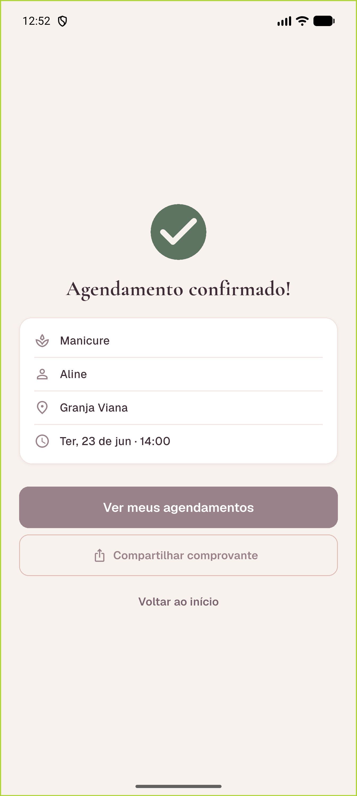<br><em>Tela de confirmação com o resumo real do agendamento.</em></td>
<td align="center">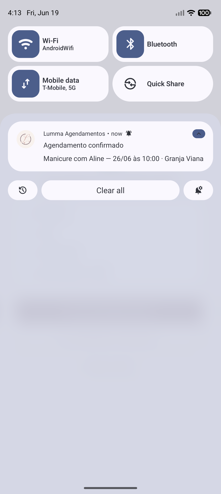<br><em>Notificação local de confirmação na barra do sistema.</em></td>
<td align="center">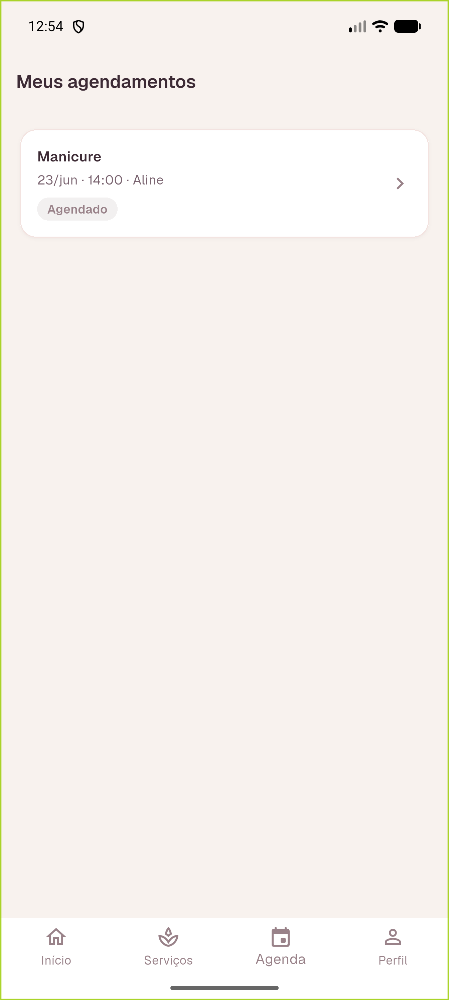<br><em>"Meus Agendamentos": o horário recém-criado, com o chip de status.</em></td>
</tr>
</table>

### Anti-overbooking: o 409

Se eu tentar marcar um horário que outra pessoa acabou de reservar com a mesma profissional, o backend devolve um
**conflito (HTTP 409)** e o app trata com uma mensagem clara, sem stacktrace, e recarrega os horários livres.

<p align="center">
  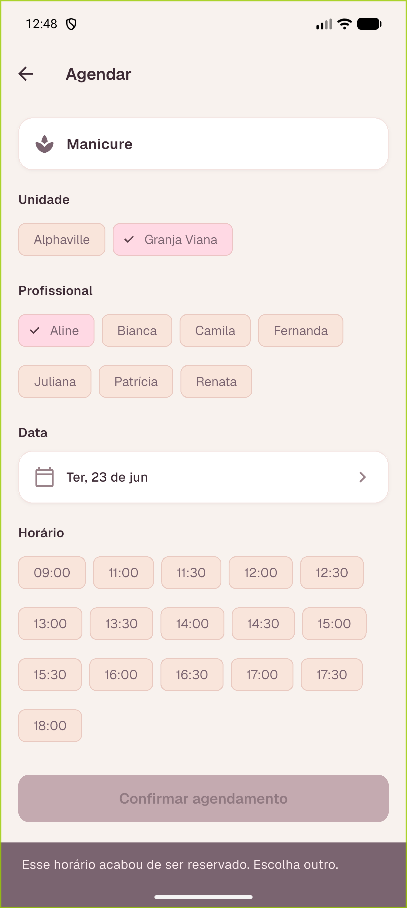<br>
  <em>"Esse horário acabou de ser reservado. Escolha outro." O slot desaparece da grade ao recarregar.</em>
</p>

### Detalhe: compartilhar, salvar na agenda e cancelar

No detalhe do agendamento eu tenho três recursos nativos. **Compartilhar comprovante** monta um comprovante com
os dados reais e usa a folha de compartilhamento nativa do sistema. **Salvar na agenda** gera um arquivo de
calendário no padrão iCalendar (`.ics`), com o fuso de São Paulo, e abre direto na tela de novo evento do app de
agenda. E **Cancelar** atualiza o status e desfaz o lembrete agendado.

<table>
<tr>
<td align="center">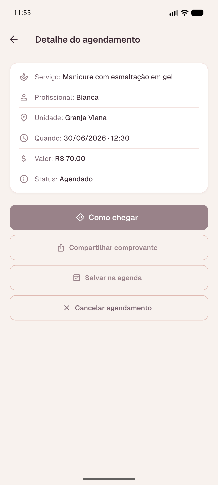<br><em>Detalhe com as três ações: Como chegar, Compartilhar comprovante e Salvar na agenda.</em></td>
<td align="center">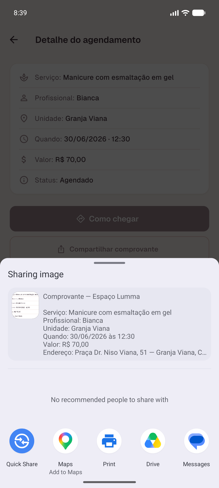<br><em>Folha de compartilhamento nativa com o comprovante (imagem do card + texto).</em></td>
<td align="center">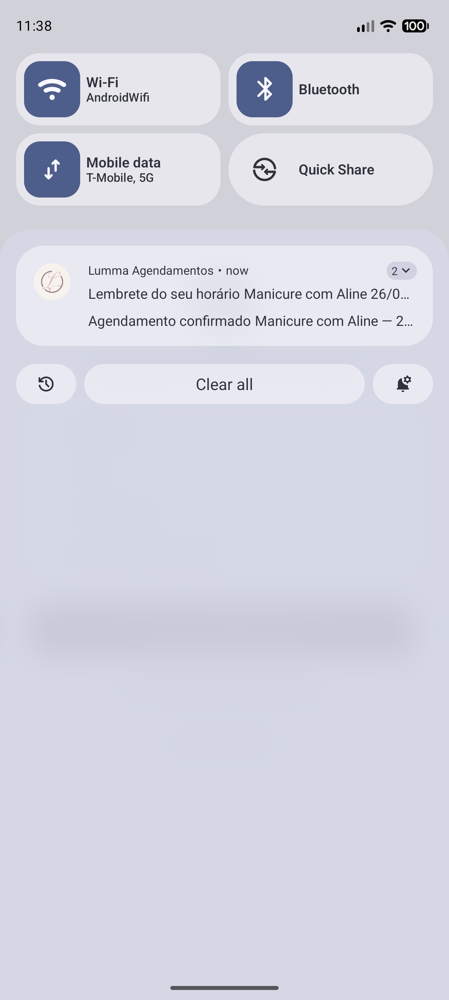<br><em>Lembrete do horário disparando na barra de notificações.</em></td>
</tr>
</table>

<table>
<tr>
<td align="center">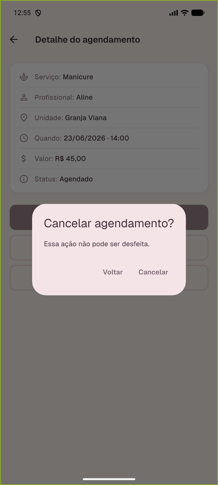<br><em>Confirmação antes de cancelar, porque é uma ação destrutiva.</em></td>
<td align="center">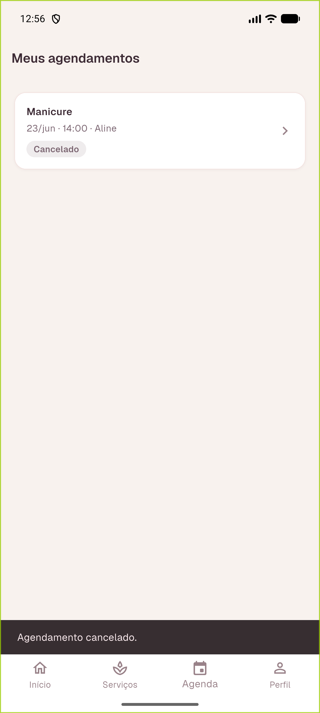<br><em>Após cancelar: o status vira "Cancelado".</em></td>
<td align="center">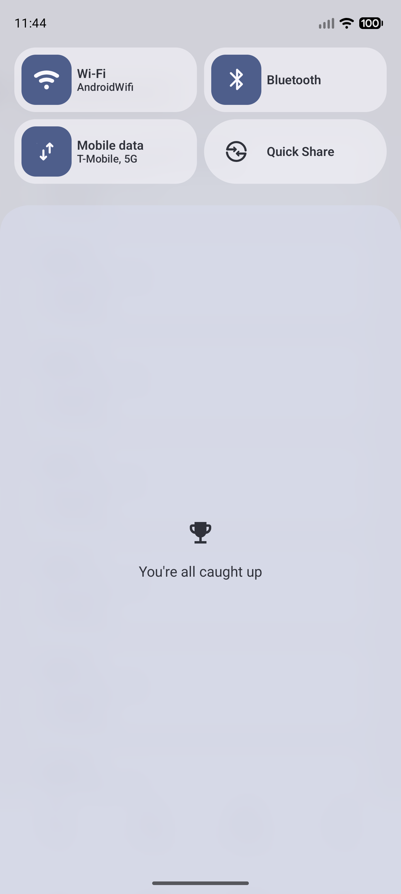<br><em>Passado o horário do lembrete, ele não dispara, porque o cancelamento fechou o loop.</em></td>
</tr>
</table>

## Agendamento por linguagem natural (IA)

Além do passo a passo, o app aceita um pedido em texto livre. A pessoa escreve algo como "manicure sexta de manhã
com a Aline" e o app monta o agendamento a partir disso, sem nunca reservar sozinho: ela revisa o que veio
preenchido e confirma.

Como funciona, do toque ao horário:

1. O app envia o texto para `POST /api/booking/interpretar` (autenticado).
2. O backend injeta o catálogo real (serviços, profissionais, unidades) e a data de hoje num prompt e pede ao
   modelo de linguagem uma resposta só em JSON.
3. A saída do modelo é validada campo a campo contra o catálogo: serviço e profissional precisam existir, a
   unidade vira o identificador real, data no passado e horário inválido são descartados.
4. Quando a frase cita a profissional mas não a unidade, o backend escolhe a unidade dela, a única em que atende
   ou, havendo mais de uma, a com mais horários livres no dia.
5. Os horários sugeridos saem do mesmo cálculo de disponibilidade da reserva normal. Um horário específico pedido
   e livre já vem selecionado; sem horário nem período, as sugestões vêm da manhã por padrão.
6. O app abre a tela de agendamento pré-preenchida (serviço, unidade, profissional, data e horário) e a pessoa
   confirma.

Decisões que sustentam a feature:

- **O modelo nunca é fonte de verdade.** Ele só propõe; quem decide serviço, profissional, unidade, preço,
  duração e disponibilidade é o backend, validando contra o catálogo e o cálculo de horários. Assim uma
  alucinação não vira um agendamento inválido.
- **Chave só no servidor.** A `AI_API_KEY` vive apenas no backend, sem prefixo `NEXT_PUBLIC`. O app só manda o
  texto e recebe a intenção já validada.
- **Agnóstico de provedor.** Trocar entre OpenAI e Anthropic é só mudar `AI_PROVIDER` no ambiente; o código que
  chama o modelo normaliza a resposta dos dois.
- **Degrada com elegância.** Sem chave configurada, com falha do modelo ou ao atingir o teto diário de chamadas
  (`AI_MAX_CALLS_PER_DAY`, que responde `429`), o app simplesmente segue no passo a passo manual, sem erro na tela.

O contrato completo do endpoint está em
[docs/arquitetura.md](docs/arquitetura.md#agendamento-por-linguagem-natural).

## Arquitetura

São três camadas, cada uma com uma responsabilidade clara:

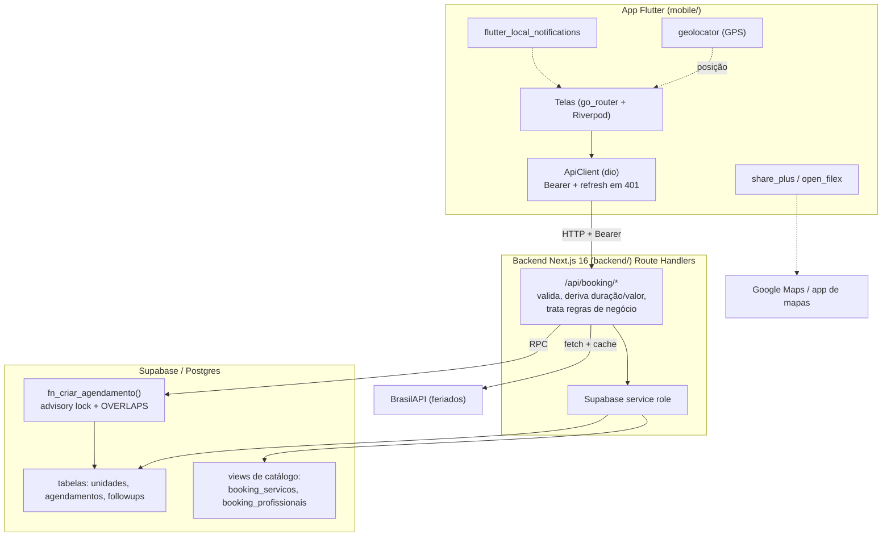

**Por que assim?**

- **App fino, backend com as regras.** O app cuida da experiência; quem decide duração, valor, se o dia é
  feriado e se o horário está livre é o backend. Assim o cliente nunca consegue forjar um valor ou furar uma
  regra mandando um JSON diferente, porque a duração e o valor são derivados do catálogo no servidor, nunca do input.
- **Backend como *route handlers* do Next.js.** É um backend próprio e autocontido, escrito para esta entrega.
  Usei Next.js 16 (App Router) porque os *route handlers* dão uma API HTTP enxuta sem framework extra, e o
  Supabase porque entrega Postgres gerenciado + autenticação + RLS num pacote só. O app **reaproveita o design
  system e a identidade visual da Lumma** (cores, tipografia, logomarca), mas o servidor e o banco desta entrega
  são construídos aqui.
- **A regra crítica mora no banco.** O anti-overbooking não dá para confiar só na aplicação: duas requisições
  simultâneas poderiam passar pela checagem antes de qualquer uma gravar. Por isso a criação é uma função
  `plpgsql` (`fn_criar_agendamento`) que serializa com *advisory lock* e re-checa sobreposição **dentro da
  transação, sob o lock**, que é o lugar certo para garantir a invariante.

O detalhamento de cada endpoint, do schema e do fluxo de dados está em **[docs/arquitetura.md](docs/arquitetura.md)**.
As decisões técnicas, em formato de registro, estão em **[docs/decisoes-tecnicas.md](docs/decisoes-tecnicas.md)**.

## Como cada requisito da atividade foi atendido

| Requisito | Como atendi | Onde no projeto |
|-----------|-------------|-----------------|
| **App nativo em Flutter** | App Flutter (Dart) rodando em Android | `mobile/` |
| **2+ telas com navegação** | Login, Cadastro, Splash, Home, Serviços, Agendar, Confirmação, Meus Agendamentos, Detalhe, Perfil, com navegação por abas e rotas e redirect por autenticação | `mobile/lib/routing/app_router.dart` (go_router) |
| **Backend integrado** | API HTTP própria consumida pelo app via `dio` com Bearer e refresh em 401 | `backend/app/api/booking/*`, `mobile/lib/core/network/` |
| **Persistência em banco** | Postgres (Supabase): agendamentos criados/listados/cancelados | `backend/sql/schema.sql`, endpoints `/agendamentos` |
| **≥1 API externa** | Feriados nacionais (BrasilAPI) com cache + fail-safe; app de mapas para a rota | `backend/lib/booking/holidays.ts`, `mobile/lib/features/home/maps_helper.dart` |
| **Notificações** | Notificação local de confirmação ao criar + lembrete antes do horário, cancelado junto com o agendamento | `mobile/lib/core/notifications/notification_service.dart` |
| **Compartilhamento nativo** | Folha de compartilhamento do SO com o comprovante (imagem + texto) | `mobile/lib/features/appointments/comprovante_helper.dart` (share_plus) |
| **Hardware do dispositivo** | GPS: distância às unidades e ordenação por proximidade | `mobile/lib/features/home/location_service.dart` (geolocator) |
| **Interface coerente** | Design system próprio (cores, tipografia, componentes) consistente em todas as telas | `mobile/lib/core/theme/`, `mobile/lib/shared/widgets/` |
| **Erro / loading / vazio** | Todo consumo de API trata os três estados via `AsyncValue.when` + componentes de estado | `mobile/lib/shared/widgets/state_views.dart`, telas em `features/` |
| **"Salvar na agenda" (extra)** | Gera `.ics` (iCalendar, fuso de SP) e abre no app de agenda | `comprovante_helper.dart` (open_filex) |
| **Agendamento por linguagem natural (extra)** | Texto livre vira intenção validada pelo backend e pré-preenche o fluxo; o modelo nunca é fonte de verdade | `backend/lib/ai/`, `backend/app/api/booking/interpretar/`, `mobile/lib/features/services/interpretar_repository.dart` |
| **Documentação** | Este README + `docs/arquitetura.md` + `docs/decisoes-tecnicas.md` | `README.md`, `docs/` |
| **Vídeo** | Demonstração das features em vídeo | [`docs/video_demo.mp4`](docs/video_demo.mp4) |
| **Repositório público** | Este repositório no GitHub | raiz do repositório |

## Stack e bibliotecas, com justificativa

**App (Flutter)**

| Biblioteca | Para quê | Por que essa |
|------------|----------|--------------|
| `flutter_riverpod` | Estado e injeção de dependência | `AsyncValue` modela loading/erro/dado de forma limpa; `FutureProvider.family` casa com chamadas parametrizadas (disponibilidade por data/profissional) |
| `go_router` | Rotas + navegação por abas | `redirect` declarativo por estado de autenticação e `StatefulShellRoute` para a bottom nav |
| `dio` | Cliente HTTP | Interceptors para injetar o Bearer, fazer refresh em 401 e converter erro em `ApiException` num lugar só |
| `flutter_secure_storage` | Guardar tokens | Armazenamento seguro do SO, não em texto puro |
| `geolocator` | GPS | API direta para permissão, posição e `distanceBetween` |
| `url_launcher` | Abrir mapas | Deep link para a rota no app de mapas |
| `flutter_local_notifications` + `timezone` | Notificações locais | Confirmação imediata e lembrete agendado com fuso `America/Sao_Paulo` |
| `share_plus` | Compartilhar | Folha de compartilhamento nativa, com imagem + texto |
| `open_filex` | Abrir o `.ics` | Dispara o intent de visualização do arquivo de calendário |
| `flutter_svg`, `flutter_launcher_icons` | Marca e ícone | Logomarca vetorial e ícone do launcher |

**Backend (Next.js + Supabase)**

| Escolha | Para quê | Por que essa |
|---------|----------|--------------|
| Next.js 16 (route handlers) | API HTTP | API enxuta sem framework extra; um arquivo por recurso |
| Supabase (Postgres + Auth) | Banco + autenticação | Postgres gerenciado, auth pronta e RLS por role no mesmo lugar |
| `@supabase/supabase-js` (service role) | Acesso ao banco pelo servidor | O backend é a única coisa que escreve, sempre via service role |
| `pg_advisory_xact_lock` + `OVERLAPS` (plpgsql) | Anti-overbooking | Garante a invariante no nível do banco, onde a concorrência de fato acontece |
| BrasilAPI | Feriados nacionais | Fonte pública e confiável; consumo com cache e fail-safe |

## Como rodar o projeto

São duas partes: o **backend** (Next.js) e o **app** (Flutter). O app fala com o backend em
`http://10.0.2.2:3000`, que é como o emulador Android enxerga o `localhost` da máquina.

### Backend

```bash
cd backend
npm install
cp .env.example .env     # preencha com os dados do SEU projeto Supabase
npm run dev              # sobe em http://localhost:3000
```

Variáveis de ambiente em `backend/.env` (**use as suas; não há credenciais reais no repositório**):

```env
NEXT_PUBLIC_SUPABASE_URL=<SUA_SUPABASE_URL>
NEXT_PUBLIC_SUPABASE_ANON_KEY=<SUA_ANON_KEY>
SUPABASE_SERVICE_ROLE_KEY=<SUA_SERVICE_ROLE_KEY>   # server-only, NUNCA prefixar com NEXT_PUBLIC
# Opcional, só para aplicar o SQL via script:
# DATABASE_URL=postgresql://postgres.<ref>:<senha>@aws-0-<region>.pooler.supabase.com:5432/postgres

# Agendamento por linguagem natural (opcional). A chave fica SÓ no backend, nunca em NEXT_PUBLIC.
# Sem AI_API_KEY, o app simplesmente segue no fluxo manual.
AI_PROVIDER=openai                 # openai (padrão) ou anthropic
AI_API_KEY=<SUA_CHAVE>             # OpenAI: sk-...  | Anthropic: sk-ant-...
AI_MODEL=gpt-4o-mini               # OpenAI: gpt-4o-mini  | Anthropic: claude-haiku-4-5
AI_MAX_CALLS_PER_DAY=200           # teto diário de chamadas ao modelo
```

Onde obter: no painel do Supabase, em **Project Settings → API** (URL e chaves) e **Database → Connection
string** (a `DATABASE_URL`, se for aplicar o SQL por script).

Aplicar o schema, as funções e o seed no banco (uma vez): rode `backend/sql/schema.sql`, `functions.sql` e
`seed.sql` no SQL Editor do Supabase, ou, com a `DATABASE_URL` configurada, `npm run db:apply`.

Conferir que subiu:

```bash
curl http://localhost:3000/api/health
curl "http://localhost:3000/api/booking/feriados?ano=2026"
```

### App (Flutter)

```bash
cd mobile
flutter pub get

# Suba um emulador Android em cold boot e espere o boot terminar:
emulator -avd <NOME_DO_AVD> -no-snapshot
adb wait-for-device && adb shell getprop sys.boot_completed   # deve retornar 1

# Rode apontando para o backend:
flutter run -d emulator-5554 --dart-define=API_BASE_URL=http://10.0.2.2:3000
```

A base URL é injetada em build time via `--dart-define=API_BASE_URL` (default `http://10.0.2.2:3000`). Para um
**dispositivo físico**, use o IP da máquina na LAN (ex.: `http://192.168.0.10:3000`); para o **simulador iOS**,
`http://localhost:3000`. As instruções detalhadas (ícone, cleartext HTTP, lock de AVD) estão em
[mobile/README.md](mobile/README.md).

> Para avaliar, dá para criar uma conta nova pela própria tela de cadastro do app.

## Problemas que enfrentei e como resolvi

Esta é a parte que mais me ensinou. Cada item abaixo é um problema real que apareceu, por que era difícil, o que
eu decidi e o trade-off que aceitei.

### Overbooking: garantir que dois clientes não peguem o mesmo horário

**O problema.** Duas pessoas podem tentar marcar o mesmo horário com a mesma profissional quase ao mesmo tempo.
Se eu só checasse "esse horário está livre?" na aplicação e depois inserisse, as duas requisições poderiam passar
pela checagem antes de qualquer uma gravar, e eu teria overbooking.

**Por que era difícil.** É uma condição de corrida. Não dá para resolver com `SELECT` seguido de `INSERT` na
aplicação, porque há uma janela entre os dois passos. Travar a tabela inteira resolveria, mas mataria a
concorrência: ninguém conseguiria marcar nada enquanto outra pessoa marca qualquer coisa.

**O que decidi.** Joguei a invariante para dentro do banco, numa função `plpgsql` (`fn_criar_agendamento`). Ela
faz `pg_advisory_xact_lock` numa chave derivada de `profissional|data|unidade`, ou seja, serializa **só** as
tentativas para aquele mesmo profissional, naquele dia, naquela unidade; todo o resto segue concorrente. Sob o
lock, ela re-checa sobreposição de horários com o operador `OVERLAPS` (considerando a duração do serviço) e,
se houver choque, aborta. O lock é de transação, então solta sozinho no commit.

**Trade-off.** A criação de agendamento deixa de ser um `INSERT` simples e vira uma chamada de função, com um pouco
mais de complexidade no backend. Em troca, a garantia é forte e o impacto na concorrência é mínimo (a
serialização é por profissional/dia, não global). Achei um troco justo.

### O 409 "horário tomado" vs. o 23505 de duplicado

**O problema.** A minha função levanta exceção quando o horário está ocupado, mas o Postgres também levanta a
mesma família de erro (`23505`, *unique_violation*) quando a constraint de **deduplicação** de registros é
violada, que são duas situações diferentes chegando com o mesmo código.

**Por que era difícil.** Se eu tratasse todo `23505` igual, ou mostraria "horário tomado" para um caso que não é,
ou vazaria erro técnico. Eu precisava distinguir "esse horário foi tomado por outra pessoa agora" de "esse
registro idêntico já existe".

**O que decidi.** A função levanta a exceção de overbooking com uma **mensagem específica** (`SLOT_TAKEN`),
mesmo compartilhando o código `23505`. No route handler eu inspeciono a mensagem: se contém `SLOT_TAKEN`, devolvo
**409** com "Horário já reservado"; se é um `23505` sem essa marca, devolvo **422** "Conflito de registro
(duplicado)". O app mapeia o 409 para a mensagem amigável e recarrega os horários. No smoke final isso aparece
nítido: tentar o mesmo slot que outro usuário ocupou dá `409 "Horário já reservado"`, enquanto recriar um
registro idêntico dá `422 "Conflito de registro (duplicado)"`.

### Schema desnormalizado e a reconstrução do catálogo

**O problema.** A base de dados de agendamentos é desnormalizada: serviço, profissional, valor e duração ficam
como colunas na própria linha do agendamento, não em tabelas separadas. Eu precisava de um **catálogo** de
serviços e de profissionais para o app, mas não tinha tabelas de catálogo.

**Por que era difícil.** Os mesmos dados aparecem repetidos e com pequenas variações ao longo das linhas. Não dá
para simplesmente "listar a tabela de serviços" porque ela não existe; eu tinha que reconstruir o catálogo
canônico a partir dos próprios agendamentos.

**O que decidi.** Criei **views** que derivam o catálogo dos dados reais. `booking_servicos` agrupa por serviço
e usa a **moda** (`mode()`) da duração e a **mediana** (`percentile_disc(0.5)`) do valor, e assim eu pego o valor
representativo de cada serviço, robusto a outliers. `booking_profissionais` faz um `DISTINCT` de
profissional/unidade/serviço. O app consome essas views como se fossem um catálogo de verdade.

**Trade-off.** O catálogo é uma fotografia estatística do histórico, não uma tabela curada à mão. Para o objetivo
(oferecer as opções reais que o salão pratica) isso é suficiente e tem a vantagem de refletir os dados de fato.

### Inferir o horário comercial a partir dos dados

**O problema.** Eu precisava saber quando o salão abre para gerar os horários disponíveis, mas não havia uma
configuração formal de horário de funcionamento.

**O que decidi.** Olhando a distribuição dos agendamentos reais, o padrão de funcionamento é **terça a sábado,
das 09:00 às 19:00, em janelas de 30 minutos** (fechado domingo e segunda). Codifiquei isso como a configuração
de negócio (`BUSINESS` em `config.ts`) e o cálculo de disponibilidade parte daí, subtraindo os horários já
ocupados (por sobreposição) e os dias bloqueados (feriado ou dia fechado).

**Trade-off.** É uma regra fixa inferida, não parametrizável por unidade. Se o salão mudar o horário, é uma
mudança de configuração, aceitável para o escopo e fácil de evoluir depois para uma tabela de horários.

### GPS instável no emulador

**O problema.** A distância às unidades depende do GPS, mas no emulador o `adb emu geo fix` (setar a localização
por linha de comando) frequentemente não "pegava": o provedor de localização não atualizava, e a Home ficava em
"Obtendo localização" ou usava uma posição velha.

**Por que era difícil.** Misturava dois fatores: o provedor *fused* às vezes devolvia um cache, e a precisão
`medium` roteava para o provedor de rede em vez do GPS, que é o que o `geo fix` alimenta.

**O que decidi.** No serviço de localização eu forço o *location manager* da plataforma com alta precisão
(`AndroidSettings(accuracy: high, forceLocationManager: true, timeLimit: ...)`) e mantenho um *fallback* para a
última posição conhecida. E, para mexer na posição durante a demo, o caminho confiável acabou sendo a **GUI do
emulador** (Extended Controls, em Location, Set Location), não a linha de comando. A captura com as distâncias
mudando (de 2,5/9,8 para 13,8/17,1) foi feita assim.

**Trade-off.** É uma peculiaridade do emulador, não do app: em aparelho real o GPS alimenta o provedor
direto e o fluxo funciona sem essa ginástica. Documentei a limitação para a banca não tropeçar nela.

### O lembrete que, no emulador, não renderiza agendado

**O problema.** A notificação **imediata** de confirmação sempre apareceu. Mas o **lembrete agendado**
(`zonedSchedule`) não renderizava no emulador: o alarme até disparava (dá para ver no `dumpsys alarm`), mas a
notificação não aparecia. Testei nas versões 22 e 17 do plugin, com o app em primeiro e em segundo plano.

**O que decidi.** Para a demonstração ser observável, deixei o lembrete em **modo de teste**: um timer interno
do app dispara o lembrete em segundos, pelo caminho de notificação imediata (`show`), que renderiza sem
problema. O caminho de produção (`zonedSchedule` para 2h e 24h antes do horário) continua implementado no código,
protegido pela mesma lógica de permissão.

**Trade-off.** No emulador, o lembrete que aparece no vídeo é o do timer. Em produção, é o agendado pelo sistema
operacional. Preferi ser honesto sobre isso a esconder: a feature existe e está provada de ponta a ponta; o que
muda é o gatilho no ambiente de teste.

### Salvar na agenda sem conta Google no emulador

**O problema.** O "Salvar na agenda" gera um `.ics` e pede ao SO para abrir num app de calendário. O único
calendário pré-instalado no emulador é o Google Calendar, que **exige login numa conta Google** para adicionar
evento, e o emulador não tinha conta.

**O que decidi.** Instalei o **Etar**, um app de calendário de código aberto que funciona **offline**, sem conta.
Ele passou a aparecer no seletor "Abrir com" e abre o evento já preenchido a partir do `.ics`. O arquivo que eu
gero está correto: `TZID=America/Sao_Paulo` (para o horário não cair deslocado), fim igual ao início mais a
duração do serviço, local com o endereço real e descrição com profissional e unidade.

**Trade-off.** É uma escolha de ambiente de teste; em aparelho real o `.ics` abre no app de agenda que a pessoa
já usa (Google, Samsung etc.). O importante, que é gerar um `.ics` válido e disparar o intent de abrir a agenda,
está feito.

### Match estrito por e-mail e sua limitação

**O problema.** "Meus Agendamentos" precisa mostrar só os agendamentos do usuário logado, mas a base traz tanto
e-mail quanto telefone, com qualidade variável.

**O que decidi.** A listagem filtra por **e-mail exato** do usuário autenticado. É simples, previsível e não
corre o risco de vazar o agendamento de outra pessoa por um telefone parecido.

**Trade-off (limitação conhecida).** Se um agendamento antigo foi feito sem e-mail, ou com um e-mail diferente do
que a pessoa usou para criar a conta no app, ele **não aparece** na lista dela. Foi uma decisão consciente: eu
prefiro **não mostrar demais** (errar para o lado seguro) a arriscar mostrar o horário de outra pessoa. O próximo
passo seria reconciliar identidade por telefone verificado.

## Limitações conhecidas e próximos passos

- **Notificação só local.** Hoje as notificações são locais (confirmação + lembrete). O próximo passo é **push
  real** (FCM) para o lembrete chegar mesmo com o app fechado por dias.
- **Sem pagamento.** O fluxo termina no agendamento confirmado; não há sinal nem pagamento. Seria a evolução
  natural para reduzir faltas.
- **Janela de agendamento longa.** Hoje dá para marcar com até um ano de antecedência; faz sentido encurtar para
  uma janela mais realista (ex.: 60 dias).
- **Match por e-mail** (ver _Match estrito por e-mail e sua limitação_): reconciliar por telefone verificado para puxar histórico antigo.
- **Horário comercial fixo**: evoluir para horários por unidade, configuráveis.

## Checklist de entrega

Marquei com base no que está de fato provado: o smoke final passou em todos os elos de backend, as telas têm as
capturas desta documentação e o vídeo de demonstração está no repositório.

| Item | Status | Evidência |
|------|--------|-----------|
| App nativo em Flutter | ✅ | `mobile/` |
| Duas ou mais telas navegáveis | ✅ | 10 telas (ver _Como cada requisito da atividade foi atendido_) / `app_router.dart` |
| Navegação entre telas | ✅ | go_router + bottom nav |
| Backend integrado | ✅ | `backend/`, app consome via dio |
| Persistência em banco | ✅ | Postgres/Supabase, criar/listar/cancelar |
| API externa | ✅ | BrasilAPI (feriados) + mapas |
| Notificações | ✅ | confirmação + lembrete (ver _Demonstração em telas_); lembrete via timer no emulador, `zonedSchedule` em produção |
| Compartilhamento nativo | ✅ | share sheet nativo (ver _Demonstração em telas_) |
| Hardware do dispositivo | ✅ | GPS (ver _Home com GPS ativo_) |
| Interface coerente | ✅ | design system próprio |
| Tratamento de erro/loading/vazio | ✅ | `state_views.dart`, telas |
| "Salvar na agenda" (.ics) | ✅ | `.ics` válido + Etar (ver _Detalhe: compartilhar, salvar na agenda e cancelar_) |
| Agendamento por linguagem natural (IA, extra) | ✅ | `backend/lib/ai/` + `/interpretar` (ver _Agendamento por linguagem natural (IA)_) |
| Documentação | ✅ | este README + `docs/` |
| Repositório público | ✅ | este repositório |
| Vídeo de demonstração | ✅ | [`docs/video_demo.mp4`](docs/video_demo.mp4) |

## Vídeo de demonstração

O vídeo está no repositório, em [`docs/video_demo.mp4`](docs/video_demo.mp4), e percorre o fluxo principal do app.

## Estrutura do repositório

```
ponderada-app/
├── README.md                  ← este documento
├── mobile/                    ← app Flutter
│   ├── lib/
│   │   ├── main.dart · app.dart
│   │   ├── core/              theme/ · network/ (dio) · auth/ · notifications/
│   │   ├── routing/           app_router.dart (go_router)
│   │   ├── features/          auth · services · appointments · home · profile
│   │   └── shared/widgets/    cards, estados de loading/erro/vazio
│   └── README.md              ← instruções detalhadas de execução do app
├── backend/                   ← API Next.js + SQL
│   ├── app/api/booking/*      route handlers (auth, servicos, profissionais,
│   │                            unidades, disponibilidade, agendamentos, feriados, perfil)
│   ├── app/api/health         health check
│   ├── lib/booking/           config (horário/unidades), holidays (BrasilAPI), http
│   ├── lib/supabase/          service role client
│   └── sql/                   schema.sql · functions.sql · seed.sql
└── docs/
    ├── arquitetura.md         arquitetura detalhada + contratos de endpoint + schema
    ├── decisoes-tecnicas.md   registro de decisões técnicas
    └── screenshots/           todas as capturas usadas nesta documentação
```
