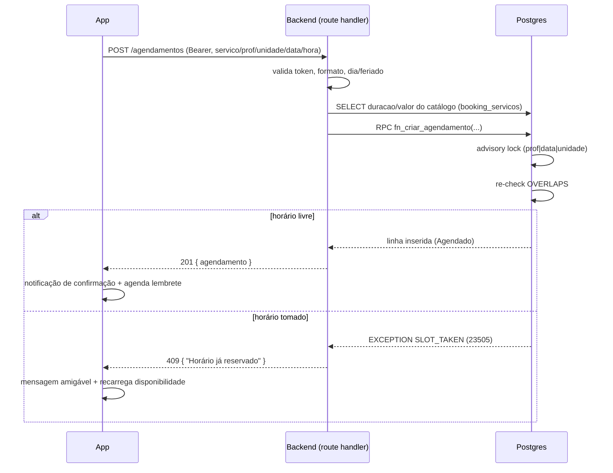

# Arquitetura do Lumma Agendamentos

Este documento detalha a arquitetura do projeto: as camadas, o mapa de rotas, os contratos de cada endpoint e o
modelo de dados. O panorama e o "porquê" das decisões estão no [README principal](../README.md); aqui é a
referência técnica.

## Camadas

| Camada | O que faz | Stack |
|--------|-----------|-------|
| **App** (`mobile/`) | Experiência do usuário: telas, navegação, GPS, notificações, share, agenda. Não decide regra de negócio. | Flutter / Dart, Riverpod, go_router, dio |
| **Backend** (`backend/`) | API HTTP. Valida entrada, deriva duração/valor do catálogo, aplica regras (feriado, dia fechado, anti-overbooking) e fala com o banco via service role. | Next.js 16 (route handlers), `@supabase/supabase-js` |
| **Banco** (Supabase/Postgres) | Persistência e a invariante crítica (criação atômica de agendamento). | Postgres, plpgsql, RLS |

O app **nunca** acessa o banco direto. Tudo passa pelo backend, que é a única coisa que usa a *service role* do
Supabase. O cliente recebe um token de acesso no login e o envia como `Bearer` nas chamadas autenticadas.

## Mapa de rotas: público vs. autenticado

A regra é simples: **dado público do salão** (o que qualquer pessoa poderia ver numa vitrine) é aberto; **qualquer
coisa que toque dado de cliente** exige `Bearer`.

| Endpoint | Método | Auth | Observação |
|----------|--------|------|------------|
| `/api/health` | GET | público | health check |
| `/api/booking/auth/signup` | POST | público | cria usuário, devolve token |
| `/api/booking/auth/login` | POST | público | autentica, devolve token |
| `/api/booking/auth/refresh` | POST | público | renova o token de acesso |
| `/api/booking/feriados` | GET | **público** | feriados do ano (dado público) |
| `/api/booking/disponibilidade` | GET | **público** | horários livres (dado público do salão) |
| `/api/booking/servicos` | GET | Bearer | catálogo de serviços |
| `/api/booking/profissionais` | GET | Bearer | catálogo de profissionais (filtra por unidade/serviço) |
| `/api/booking/unidades` | GET | Bearer | unidades com endereço e coordenadas |
| `/api/booking/perfil` | GET | Bearer | dados do usuário logado |
| `/api/booking/agendamentos` | GET | Bearer | lista do usuário (match por e-mail) |
| `/api/booking/agendamentos` | POST | Bearer | cria (via `fn_criar_agendamento`) |
| `/api/booking/agendamentos/{id}/cancelar` | PATCH | Bearer | cancela |

## Contratos de endpoint

### Autenticação

```
POST /api/booking/auth/signup
body: { nome, email, telefone, senha }
200:  { access_token, refresh_token, user: { email, nome, telefone } }

POST /api/booking/auth/login
body: { email, senha }
200:  { access_token, refresh_token, user: { ... } }
401:  { error }

POST /api/booking/auth/refresh
body: { refresh_token }
200:  { access_token, refresh_token }
```

O app guarda os tokens em `flutter_secure_storage`. O `ApiClient` (dio) injeta `Authorization: Bearer <access>`
e, ao tomar 401, tenta `refresh` uma vez antes de desistir e mandar para o login.

### Catálogo

```
GET /api/booking/servicos                 (Bearer)
200: { servicos: [ { servico, duracao_minutos, valor, total } ] }

GET /api/booking/profissionais?unidade_id=&servico=   (Bearer)
200: { profissionais: [ { profissional } ] }

GET /api/booking/unidades                 (Bearer)
200: { unidades: [ { id, nome, endereco, lat, lng } ] }
```

`servicos` e `profissionais` saem das **views** `booking_servicos` / `booking_profissionais`, que derivam o
catálogo dos próprios agendamentos (ver "Modelo de dados").

### Disponibilidade e feriados

```
GET /api/booking/disponibilidade?data=YYYY-MM-DD&profissional=&unidade_id=&servico=   (público)
200 (aberto):  { data, aberto: true, duracao_minutos, slots: [ { hora, disponivel } ] }
200 (fechado): { data, aberto: false, motivo: "Feriado nacional" | "Salão fechado neste dia da semana" | "Data no passado", slots: [] }
422: { error }   // data inválida ou profissional ausente

GET /api/booking/feriados?ano=2026         (público)
200: { ano, feriados: [ "YYYY-MM-DD", ... ] }
```

O cálculo de disponibilidade: parte do horário comercial (`BUSINESS`: de terça a sábado, das 09:00 às 19:00, em
janelas de 30 min), remove os intervalos já ocupados pelo profissional no dia (por **sobreposição**, considerando
a duração de cada serviço) e devolve cada slot marcado como `disponivel` ou não. Dia fechado, feriado ou data
passada retornam `aberto: false` com o motivo.

### Agendamentos

```
GET /api/booking/agendamentos?escopo=futuros|passados        (Bearer)
200: { agendamentos: [ { id, data_agendamento, hora, profissional, servico,
                         duracao_minutos, valor, status, unidade_id, observacoes } ] }

POST /api/booking/agendamentos                               (Bearer)
body: { servico, profissional, unidade_id, data: "YYYY-MM-DD", hora: "HH:MM", observacoes? }
201: { agendamento: { ... , status: "Agendado" } }
409: { error: "Horário já reservado" }              // SLOT_TAKEN (advisory lock + overlap)
422: { error: "Conflito de registro (duplicado)" }  // 23505 da constraint de dedup
422: { error }                                       // validação / dia fechado / feriado / data passada

PATCH /api/booking/agendamentos/{id}/cancelar               (Bearer)
200: { agendamento: { ... , status: "Cancelado" } }
```

A listagem filtra por **e-mail exato** do usuário autenticado (decisão consciente, ver
[decisoes-tecnicas.md](decisoes-tecnicas.md)). No POST, a duração e o valor são **derivados do catálogo no
servidor**, e o que o cliente manda nesses campos é ignorado.

## Modelo de dados

Três tabelas e duas views de catálogo. O DDL completo está em [`backend/sql/schema.sql`](../backend/sql/schema.sql)
e a função em [`backend/sql/functions.sql`](../backend/sql/functions.sql).

### Tabelas

- **`unidades`**: `id` (uuid), `nome` (único). Duas linhas: Granja Viana e Alphaville.
- **`agendamentos`**: a tabela central, **desnormalizada**. Cada linha tem `data_agendamento`, `hora`,
  `profissional`, `servico`, `duracao_minutos`, `cliente`, `telefone`, `email`, `valor`, `status`,
  `observacoes`, `unidade_id` e campos de origem (`row_hash`, `source_occurrence`, `categoria_atendimento`).
  Tem índices por data, unidade+data, status+data, e-mail e telefone.
- **`followups`**: anotações por telefone (não usada pelo app cliente; faz parte do domínio).

Uma constraint de unicidade (`agendamentos_unique_business_slot`) sobre
`(unidade_id, data_agendamento, hora, profissional, cliente, servico, source_occurrence)` faz a **deduplicação**
de registros, e é ela que dispara o `23505` distinto do `SLOT_TAKEN`.

### Views de catálogo (reconstrução canônica)

```sql
-- duração = moda; valor = mediana; ambos por serviço, a partir dos dados reais
CREATE VIEW booking_servicos AS
  SELECT servico,
         mode() WITHIN GROUP (ORDER BY duracao_minutos)     AS duracao_minutos,
         percentile_disc(0.5) WITHIN GROUP (ORDER BY valor) AS valor,
         count(*) AS total
  FROM agendamentos WHERE servico IS NOT NULL AND servico <> ''
  GROUP BY servico;

CREATE VIEW booking_profissionais AS
  SELECT DISTINCT profissional, unidade_id, servico
  FROM agendamentos WHERE profissional IS NOT NULL AND profissional <> '';
```

### Função de criação atômica

`fn_criar_agendamento(...)`, executada só pela *service role*:

1. `pg_advisory_xact_lock(hashtext(profissional|data|unidade))`: serializa apenas o mesmo profissional/dia/unidade.
2. Re-checa **sobreposição** (`OVERLAPS`, ignorando `Cancelado`/`Cliente não compareceu`) sob o lock.
3. Se houver choque, `RAISE EXCEPTION 'SLOT_TAKEN' USING ERRCODE = '23505'`.
4. Senão, insere com `status = 'Agendado'` e retorna a linha.

O lock é de transação: solta sozinho no commit/rollback.

## Fluxo de criação de um agendamento



## Segurança

- **Service role só no servidor.** A chave de service role nunca vai para o app; só o backend a usa.
- **RLS por role** nas tabelas (admin/comercial) para o domínio mais amplo; o app cliente acessa sempre via
  backend, que medeia com a service role.
- **Bearer + refresh.** O app envia o token de acesso; em 401, tenta refresh uma vez antes de cair para o login.
- **Cleartext HTTP** está habilitado **apenas** para o cenário de desenvolvimento (emulador para `http://10.0.2.2`).
  Em produção, a base URL apontaria para HTTPS.
